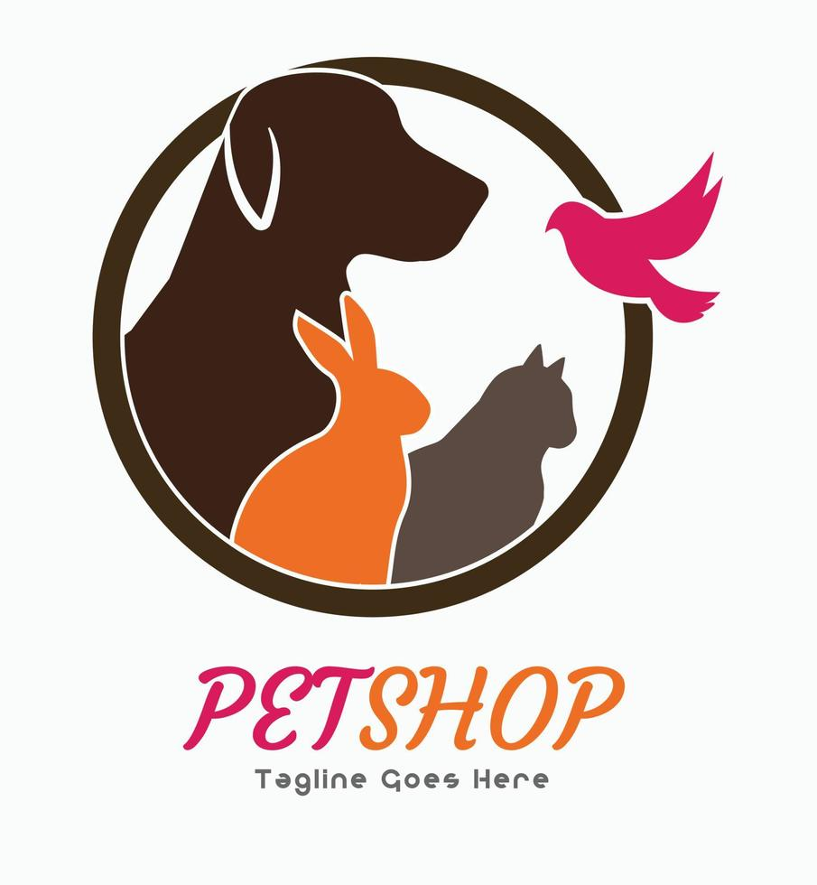

# **My Petshop**

## Tabla de contenido

        -[Acerca de Nosotros]

         En **PetShop** nos dedicadamos a ofrecer una amplia variedad de productos y servicios para el cuidado y bienestar de tus mascotas. Nos apasiona proporcionar lo mejor para nuestros amigos peludos, emplumados y escamosos, asegurando que tengan todo lo que necesitan para vivir felices y saludables.

## Misión
            Nuestra misión es ser el destino preferido para los amantes de las mascotas, brindando productos de alta calidad y servicios excepcionales que mejoren la vida de las mascotas y de sus dueños.
## Visión
            Ser la tienda de mascotas líder en el mercado, reconocida por nuestra dedicación al bienestar animal, la excelencia en el servicio al cliente y nuestra amplia gama de productos innovadores.

 ## Productos y servicios

           -Peluquería para mascotas
           -Consultas veterinarias
           -Vacunaciones
           -Entrenamiento y adiestramiento
           -Venta de Accesorios para mascotas
           -Alimentos balanceados y mas...

 ## contacto
         Para más información, puedes visitarnos en nuestra tienda física o contactarnos a través de nuestro sitio web, correo electrónico. [mi_email@example.com](Yusneyperezcanabal@Hotmail.com).
 **Teléfono**: 3022103567

## Capturas de Pantalla
.png)

## Instrucciones
1. Clonar el repositorio: `git clone https://github.com/Yusneys/Mi-Petshop.git
2. Abrir `index.html` en tu navegador favorito.

> "El mejor lugar para el cuidado de tus mascotas."

